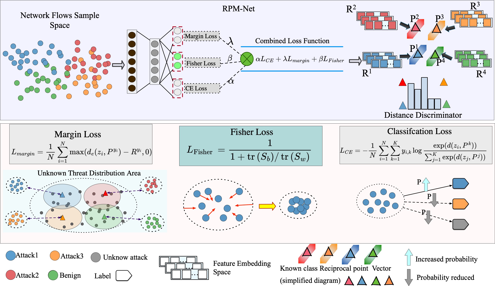

# RPM-Net
A novel framework for open set recognition in network security threat detection that introduces reciprocal point mechanism to learn "non-class" representations for each known attack category.
## 🎯 Overview

RPM-Net addresses the critical challenge of identifying unknown attacks while maintaining accurate classification of known threats in imbalanced network security environments. Unlike conventional approaches that learn what constitutes a class, RPM-Net learns what does not belong to each class, creating bounded feature spaces through adversarial margin constraints.
### Key Features

- **Reciprocal Point Mechanism**: Learns "non-class" representations for each known attack category
- **Fisher Discriminant Regularization**: Enhances intra-class compactness and inter-class separability
- **Adversarial Margin Constraints**: Creates bounded feature spaces naturally accommodating unknown classes
- **Multi-class Imbalanced Data Handling**: Effectively handles class imbalance without requiring unknown class samples during training
- **No Unknown Class Samples Required**: Training only requires known attack data

## 🏗️ Architecture



The RPM-Net architecture consists of four main components:

1. **Feature Extractor**: Multi-layer perceptron that maps input features to embedding space
2. **Reciprocal Points**: Learnable parameters representing "non-class" centers for each known class
3. **Adversarial Margin Constraints**: Define bounded regions around each reciprocal point
4. **Fisher Discriminant Regularization**: Enhances discriminative power of learned embeddings

## 🚀 Quick Start

### Installation

1. Clone the repository:
```bash
git clone https://github.com/yourusername/rpm-net.git
cd rpm-net
```

2. Install dependencies:
```bash
pip install -r requirements.txt
```
### Data Preparation

1. **CICIDS2017 Dataset**: [https://www.unb.ca/cic/datasets/ids-2017.html
](https://www.unb.ca/cic/datasets/ids-2017.html)
2. **UNSW-NB15 Dataset**: [https://www.unb.ca/cic/datasets/cic-unsw-nb15.html](https://www.unb.ca/cic/datasets/cic-unsw-nb15.html)

## 🔬 Methodology

### Reciprocal Point Mechanism

Unlike traditional methods that learn class prototypes representing "what a class is," our reciprocal points represent "what a class is not." For each known class k, the reciprocal point P^k serves as the center of the feature space region that should not contain samples from class k.

The distance from an embedding z = φ(x) to reciprocal point P^k is computed as:

$d(z, P^k) = d_e(z, P^k) - d_c(z, P^k)$


where:
- $$d_e(z, P^k) = ||z - P^k||²₂ / m$$ is the normalized Euclidean distance
- $$d_c(z, P^k) = z^T P^k / (||z||₂ ||P^k||₂)$$ is the cosine similarity

### Fisher Discriminant Regularization

To enhance the discriminative power of learned embeddings, we incorporate Fisher discriminant regularization that maximizes the ratio of inter-class scatter to intra-class scatter:

$$L_Fisher = 1 / (1 + S_b/S_w)$$

where $S_w$ is the within-class scatter and $S_b$ is the between-class scatter.
### Training Objective

The overall training loss combines classification, margin, and Fisher discriminant objectives:

$$L_total = α L_CE + λ L_margin + β L_Fisher$$

where:
- $L_CE$ is the cross-entropy loss
- $L_margin$ enforces adversarial margin constraints
- $L_Fisher$ promotes intra-class compactness and inter-class separability

## 📁 Project Structure

```
rpm-net/
├── src/
│   └── rpmnet/
│       ├── __init__.py
│       ├── model.py          # RPM-Net model implementation
│       ├── losses.py         # Loss functions
│       ├── data_utils.py     # Data loading utilities
│       ├── evaluation.py     # Evaluation metrics
│       ├── training.py       # Training utilities
│       └── config.py         # Configuration class
├── examples/
│   ├── train_unsw.py         # UNSW-NB15 training example
│   ├── train_cicids2017.py   # CICIDS2017 training example
│   └── inference_example.py  # Inference example
├── docs/
│   └── rpm_structure_fig.pdf # Architecture diagram
├── tests/                    # Unit tests
├── data/                     # Dataset directory
├── results/                  # Training results
├── requirements.txt          # Dependencies
└── README.md                 # This file
```
## 📚 Citation

If you use this code in your research, please cite our paper:

```bibtex
@inproceedings{rpmnet2026,
  title={RPM-Net: Reciprocal Point MLP Network for Open Set Recognition in Network Security Threat Detection},
  author={jiachen zhang},
  booktitle={Proceedings of ICASSP 2026},
  year={2026}
}
```
## 📞 Contact

- **Author**: Jiachen Zhang
- **Email**: jiachen.zhang@bupt.edu.cn
- **Project Link**: [https://github.com/chiachen-chang/RPM-Net](https://github.com/chiachen-chang/RPM-Net)
